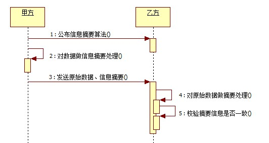

# MD5

## 一 介绍

Message Digest algorithm 5，信息摘要算法，它对信息进行摘要采集，再通过一定的位运算，最终获取加密后的 MD5 字符串。

* 一般用于确保信息传输的一致性，校验传输的数据是否被修改，一旦原始信息被修改，生成的 MD5 值将会变得很不同
* 算法能将任意大小、格式的文字或文件进行加密从而产生 128 bit（16 字节）的散列值。不同文本的 MD5 值是不同的
* 极端情况下，不同文本的 MD5 值一样，称为哈希碰撞。2009 年中科院已经实现相应的碰撞算法
* 一般不可破解，除非使用穷举法，难度依然很大

## 二 Java 实现